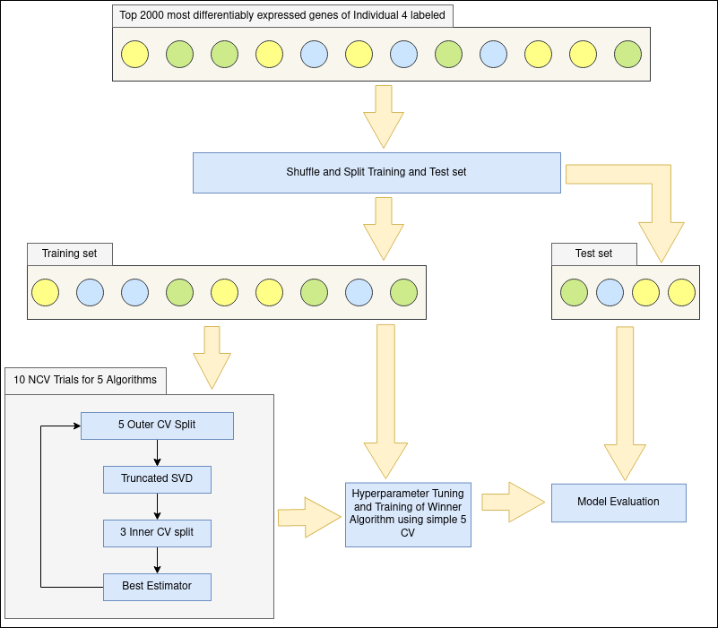
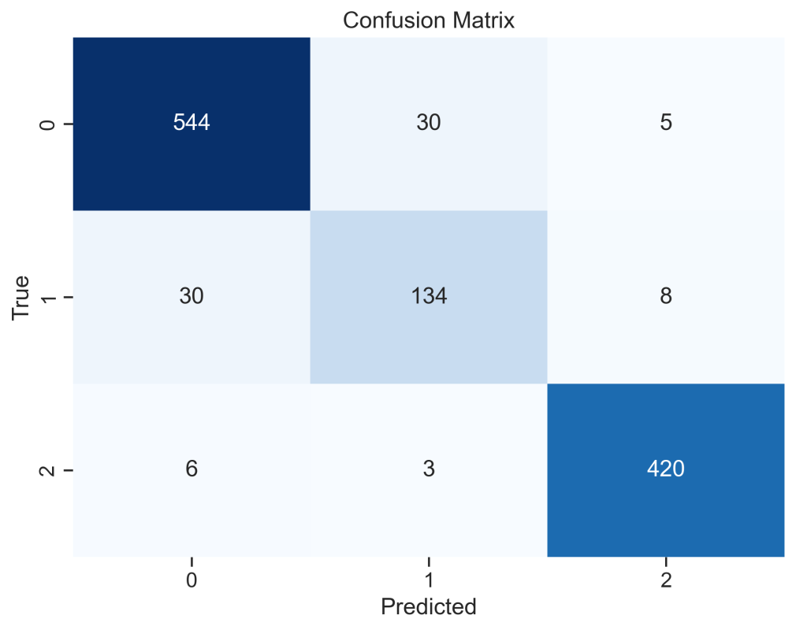

# scRNAseq_replicate

## Overview
This project has as central axis the identification of scRNA sequenced cells of the breast epithelium to one of the three major types reported in the work of Nguyen et. al. (https://europepmc.org/article/MED/29795293#abstract). There are two main analyses performed. The first is a replication of the paper's results for the dataset of individual 4 to acquire class labels for the cells. The second is the use of this now labeled dataset in a classification procedure in the attempt of creating a classifier, able to assign scRNA seq breast epithelial cells to one of those states (Basal, Luminal 1, Luminal 2).

## Differences from the initial analysis
The clustering part of the replication phase was performed differently than what is discussed in the paper. The Louvain algorithm, integrated in the Seurat package, was employed, instead of density based clustering. Based on the assignment of cells containing the marker genes of focus, the results were similar to the paper, with an 11% misclassification rate. 

## Classification phase

### Nested Cross Validation for classifier comparison
The classification phase was performed according to the pipeline presented in the image below. Nested Cross Validation (10 trials) was utilized with a 5-fold outer and a 3-fold inner loop, in conjuction with the Optuna package for hyperparameter tuning under the Bayesian framework, in order to compare 5 different classifiers. Those classifiers were Naive Bayes, Logistic Regression, Support Vector Machines (RBF Kernel), Random Forest and XGBoost. Since the dataset was imbalanced, the Matthews Correlation Coefficient was used as the primary comparison metric of the outer loops and the "winner" classifier was the one that achieved the highest average score across all 50 outer loops. Other evaluation metrics used in the outer folds included Balanced Accuracy, F1 score and F2 score, all appropriate for class imbalance cases. The hyperparameter optimization inside the inner loop was performed by setting the trials to try and maximize the Balanced Accuracy metric.

### Simple 5-fold Cross Validation for hyperparameter tuning of "winner" classifier
The "winner" classifier of the nCV was trained on the entire training set using simple 5-fold CV under the Optuna framework to optimize its hyperparameters. 

### Final model creation and testing
The classifier was fit on the whole training set using the optimized hyperparameters of the simple 5-fold CV and then tested on the held-out test set.

## Results 
The SVM algorithm with an RBF kernel was declared winner in 4/5 train (70%)-test (30%) splits, based on the comparison of the average MCC scores out of 50 outer loops for each algorithm. XGBoost was always a close second and the winner in one case. The testing of the final model gave very optimistic results with most samples being correctly classified as seen in the following confusion matrix. Most errors occured in the Luminal 2 (1) class, which contained the least samples in the dataset. The Basal class (2) achieved the highest scores in all classification report metrics.

## Future work 
The optimistic results of the model do not inherently imply the same classification ability on a new dataset. Therefore, as a future part of the project the classifier is to be tested on the datasets of the other individuals (5-7) provided in the initial study and if possible to a similar breast epithelial dataset from another study. Finally, the next proposed plan for future work is the replication of the combined analysis of the paper (individuals 4-7) and then the creation of a more advanced model that will be able to differentiate between all 5 reported cell states of the study, using the established classification pipeline as a blueprint.
